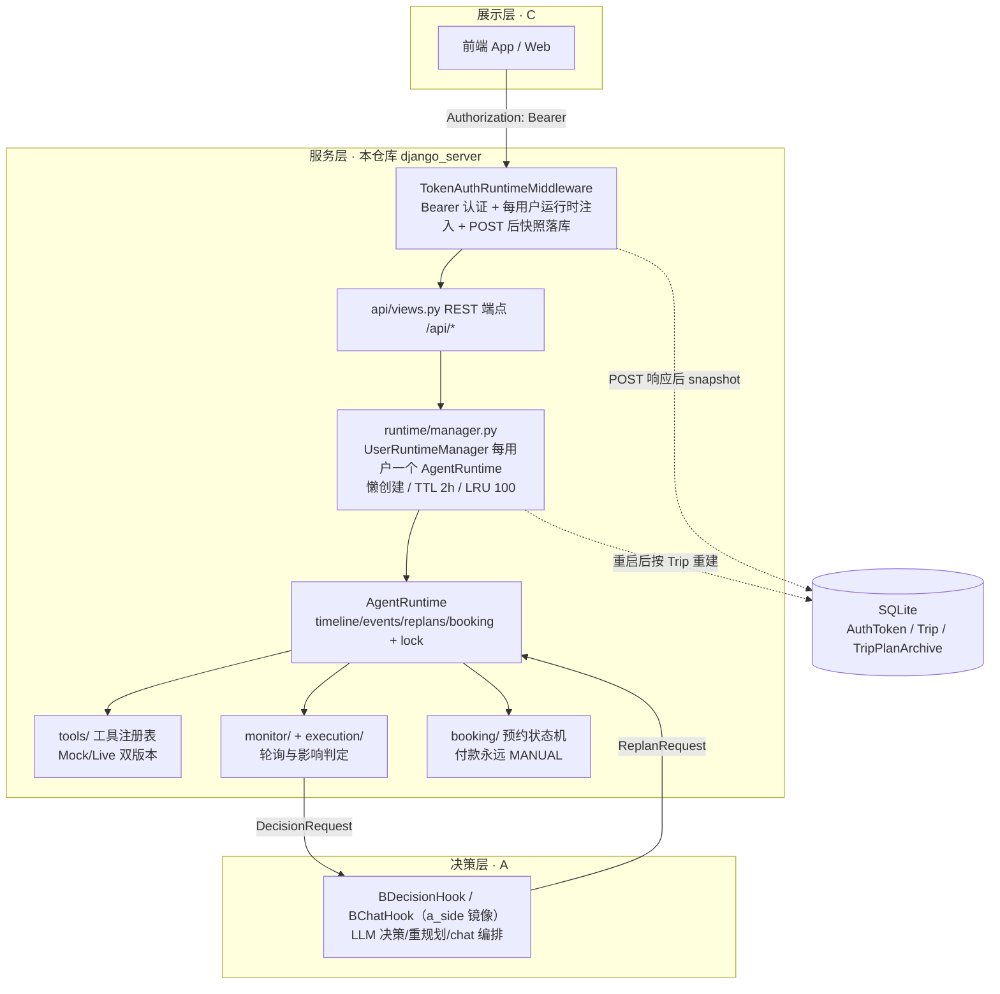

# TravelAgent —— 自主旅行管家（B 侧交付仓库）

> 帮助用户完成整个旅行生命周期（**规划 → 持续监控 → 智能决策 → 安全执行**），而不只是生成一份攻略。
>
> 本仓库是**人物 B（系统）的交付物**，对外交付面是 `django_server`（Django REST 服务）。
> 本 README 面向 **A（智能决策）/ C（产品与展示）队友**。
>
> **当前状态（2026-09-15，`server_log_dxd_260915` 分支）**：多用户改造已落地（账号 Bearer token、
> 每用户隔离运行时、SQLite 持久化、gthread 并发）；本轮补齐服务端日志观测
> （LOGGING 双通道 + request_id + 报错补记录）与**历史规划归档**（`TripPlanArchive` +
> `/api/plans/history/`）。测试基线 **622 passed**
> （另有 3 例 ab_sync 用例依赖本机外层 A 仓库布局，无该布局的环境挂属预期）。

---

## 十秒钟看懂

| 角色 | 职责 | 接入方式 | 现状 |
| --- | --- | --- | --- |
| **A**（智能决策） | Planner / Route Planner / 决策 / 重规划 / Memory | `a_side/` 镜像目录经 `django_server/runtime/a_interface.py` 的 `BDecisionHook`/`BChatHook` 注入运行时 | ✅ 已接入并持续演进（chat 编排、技能层、审查轮均在 A 侧代码） |
| **B**（系统，本仓库） | HTTP 服务、每用户运行时、工具、监控执行、预约、导出 | —— | ✅ 多用户改造完成 |
| **C**（产品展示） | 前端 App | HTTP `/api/*` + `Authorization: Bearer <token>`；接入清单见 `docs/sync_notes_multiuser_for_ac_20260912.md` | 前端需加 Bearer 头（约 3 行）+ 401 处理 |

> 历史注：早期"决策侧由 B 提供 stub（`decision/decision_engine.py`）"的故事已过时——
> 真决策在 A 侧（`a_side/` 镜像 + `BDecisionHook`）；`decision/` 与 `app/service.py`
> （FastAPI）均为遗留代码，不再是交付面。

---

## 一、总体架构（当前）



核心闭环不变：**监控 → 影响判定 → 决策请求 → 重规划 → 新监控**，但驱动方是 A 侧
LLM 决策（`a_side`），且每个登录用户独享一条这样的闭环。

## 二、多用户架构（2026-09 改造，已提交）

| 机制 | 实现 | 代码 |
| --- | --- | --- |
| 账号鉴权 | `POST /api/auth/register|login|me|logout/`；Bearer token 只存 sha256；单设备语义（登录轮换旧 token）；密码 PBKDF2（Django 内置） | `django_server/api/auth.py` |
| 门禁 | 白名单（`/api/health/`、register、login）外全部 401 fail-closed；解析出 `request.auth_user` + `request.runtime`；POST 响应后自动快照落库 | `django_server/api/middleware.py` |
| 每用户隔离 | 懒创建 `AgentRuntime`；TTL 2h / LRU 100 淘汰（只丢内存，DB 可重建）；每运行时 `RLock` 串行化同用户并发写 | `django_server/runtime/manager.py` |
| 持久化 | `Trip` 行整表覆写（requirement/timeline/events/replans/timeline_history/booking_state 六个 JSON blob）；重启后用户无感恢复 | `django_server/api/models.py` |
| 部署 | gunicorn `--workers 1 --threads 8`（**workers 永远为 1**，多 worker 会串号）；启动先 `migrate`；sqlite 落 named volume `travelagent-data` | `django_server/Dockerfile`、`docker-compose.yml` |

详细语义与 C 端最小接入：**[docs/sync_notes_multiuser_for_ac_20260912.md](docs/sync_notes_multiuser_for_ac_20260912.md)**。

---

## 三、代码库结构（实际目录）

| 路径 | 说明 |
| --- | --- |
| `django_server/` | **对外交付面**：Django REST 服务（`api/` 端点、`runtime/` 每用户运行时、`smoke/` 部署冒烟、`travelagent/` 设置） |
| `a_side/` | A 侧代码镜像（`algorithoms/`、`call_llm/`、`workflow/`、`transport/` 等）；`tests/test_ab_sync.py` 逐文件守卫与 A 主目录一致（**编辑源在 A 主目录，本目录勿直接改**） |
| `tools/` | 统一工具抽象（BaseTool/ToolRegistry）：天气4、地图、交通、景点、餐饮、预约、火车票4、酒店、web_fetch/search，Mock/Live 双版本自动切换 → 参考 `docs/tool_introduction.md` |
| `core/schemas.py` | A/B/C 共享契约：`TripTimeline`、`MonitorEvent`、`DecisionRequest`、`ReplanRequest`、`ActionItem`、`PermissionLevel` |
| `execution/` + `monitor/` | 持续监控执行体：轮询调度、影响判定、组装 `DecisionRequest`、应用 `ReplanRequest` |
| `booking/` | 预约状态机（prepare→confirm→…→payment），多用户改造后提供 snapshot/restore 抽象；**付款永远 `PermissionLevel.MANUAL`，Agent 不代付** |
| `itinerary/` | `.ics` 日历 + Markdown 行程单导出 |
| `demo/` + `fake_spots/` | 比赛演示剧情（MockWorld 突发事件注入）；`POST /api/debug/inject/` 走真实链路 → `docs/demo_event_injection.md` |
| `decision/`、`app/` | **遗留代码**（决策 stub、FastAPI 服务层），不再维护，勿接入 |
| `tests/` | 625 个用例；Django 引导在 `tests/conftest.py` 的 `pytest_configure`（临时 sqlite + migrate；`TRAVELAGENT_LOG_DISABLE=1` 下不写文件日志） |

---

## 四、A / C 接入手册（入口索引）

| 我要… | 看哪里 |
| --- | --- |
| C：接入多用户（登录 + token 头 + 401 处理，约 3 行改动） | `docs/sync_notes_multiuser_for_ac_20260912.md` |
| C：对话接口（chat，含 update_timeline 改时间轴、真源查询） | `docs/chat_api.md` |
| C：时间轴交通段契约（transport.details 渲染） | `docs/transport_contract.md` |
| C：酒店只读数据（/api/hotels 等） | `docs/C_hotel_data.md` |
| C/A：全部 REST 端点清单（真实路由） | `django_server/api/urls.py`（以代码为准） |
| C：查历史规划（/api/plans/history/）+ 报障时提供 X-Request-ID | `docs/sync_notes_server_log_for_ac_20260915.md` |
| A：工具层接口（每个工具的签名/真源端点/字段对照） | `docs/tool_introduction.md` |
| A：hotel_tool 接入适配 | `docs/A_hotel_tool_adapter.md`、`docs/hotel_tool.md` |
| B/运维：部署冒烟清单（0 认证基座 / 1 规划 / 3 满房换酒 / 4 导出 / 5 双用户隔离） | `django_server/smoke/smoke_acceptance.py` |

**鉴权速记**：除 `/api/health/`、`/api/auth/register/`、`/api/auth/login/` 外，
**所有端点**都要求 `Authorization: Bearer <token>`，无有效 token 一律 401。

---

## 五、运行方式

```bash
# 1) 单元测试（605 passed；3 例 ab_sync 需本机外层 A 仓库布局，无则挂属预期）
pip install -r requirements.txt
python -m pytest tests/ -q

# 2) 本地起服务
cd django_server
pip install -r requirements.txt
python manage.py migrate
python manage.py runserver   # http://localhost:8000/api/health/

# 注册 → 拿 token → 调业务端点
curl -X POST http://localhost:8000/api/auth/register/ \
  -H "Content-Type: application/json" -d '{"username":"demo","password":"secret66"}'
curl http://localhost:8000/api/status/ -H "Authorization: Bearer <token>"

# 3) Docker（compose 已配 sqlite 卷持久化 + 启动自动 migrate）
docker compose up --build

# 4) 部署冒烟（deploy.yml 部署后自动执行；也可手动）
docker compose exec -T web python smoke/smoke_acceptance.py

# 5) 演示剧情脚本
python -m demo.demo_scenario
```

> Mock/Live 切换：复制 `config/local_settings.example.py` 为 `config/local_settings.py`
> 填入真实 Key；`.env`（见 `.env.example`）供容器注入。**注意：本机放了真实 Key 的
> `local_settings.py` 会让默认工具走 Live 真源。**

---

## 六、可观测性与历史规划归档（server_log 2026-09-15）

**日志双通道**（`django_server/travelagent/settings.py` 的 `LOGGING`）：

- stdout（`docker logs` 可查）+ 轮转文件 `data/logs/server.log`（与 db.sqlite3 同一
  named volume，宿主机可直查；10MB×5 自动轮转）；
- 每请求生成 8 位 `request_id`（中间件），响应头回写 **`X-Request-ID`**，该请求链路上的
  全部日志（api/runtime/a_side、含异常栈）都带同一 id——报障时让 C 端提供这个 id 即可定位；
- POST 请求行（用户/状态码/耗时）记 INFO，GET 记 DEBUG；401 拒绝、登录失败、注册冲突、
  畸形 JSON 体、plan 异常/空时间轴、工具调用失败（含抛异常的）均有记录；
- gunicorn access log 已开启（含 `%(L)s` 请求耗时）；compose 侧 json-file 限 10MB×3 兜底；
- 环境变量：`TRAVELAGENT_LOG_DIR` 覆盖日志目录，`TRAVELAGENT_LOG_DISABLE=1` 关文件通道（测试用）。

**历史规划归档**（此前旧规划被 Trip 行整行覆写后无处可查）：

- 新 `POST /api/plan/` 覆写前，当前会话快照自动存入 `TripPlanArchive`（含 plan 失败场景）；
  每用户保留最近 20 份（`api/views.py` 的 `PLAN_ARCHIVE_KEEP`）；
- `GET /api/plans/history/?limit=20`：列表（requirement 全量 + timeline 天数概要）；
- `GET /api/plans/history/<id>/`：单份全量快照（requirement/timeline/events/replans/
  timeline_history/booking_state）；非本人一律 404。

---

## 七、设计决策要点（当前仍成立的）

1. **代码是唯一事实**：任何文档都是二手口径，论断以代码 + 实跑测试为准（本文档亦然，路由/行为以 `django_server/api/` 为准）。
2. **每用户一运行时，单进程多线程**：`--workers 1` 是硬约束（注册表与 sqlite 均单进程设计）；隔离靠 per-user AgentRuntime + RLock，吞吐靠 gthread 8 线程。
3. **持久化是尽力而为**：内存态始终可用；POST 后快照失败只记日志，下次请求自动从 Trip 重建。
4. **契约先行**：`core/schemas.py` 仍是 A/B/C 对齐锚点；`ActionItem`/`PermissionLevel` 语义不变。
5. **安全边界**：付款永远 `PermissionLevel.MANUAL`，预约需用户确认——Agent 不代付；12306/RollingGo 无下单边界不变。
6. **A 侧镜像守卫**：`a_side/` 由 `tests/test_ab_sync.py` 与 A 主目录逐文件比对（含 call_llm 内容级守卫），防双源漂移。

已知限制（明示不做）：明文 http 传输 token；SECRET_KEY 硬编码、DEBUG=True；不做多 worker 横向扩展；Trip 只保留每用户当前行程（新 plan 覆写；旧规划有 `TripPlanArchive` 归档，最近 20 份）；无注册审批/邮箱验证。

---

## 八、文档索引

**现行**：`docs/tool_introduction.md`（工具层）、`docs/chat_api.md`（对话）、
`docs/transport_contract.md`（交通契约）、`docs/hotel_tool.md` 系列（酒店）、
`docs/demo_event_injection.md` + `docs/event_injection_cookbook.md`（演示注入）、
`docs/sync_notes_multiuser_for_ac_20260912.md`（多用户接入）、
`docs/sync_notes_server_log_for_ac_20260915.md`（服务端日志与历史归档，最新交付口径）。

**已归档**：早期报告/对齐/交付/设计稿与带日期 sync notes 共 10 篇移入 `docs/archive/`
（见 `docs/archive/README.md`），仅作历史参考，描述与现状不符处一律以代码为准。
