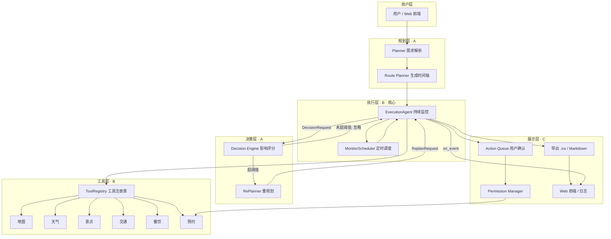

# TravelAgent —— 自主旅行管家（A/B/C 协作文档）

> 帮助用户完成整个旅行生命周期（**规划 → 持续监控 → 智能决策 → 安全执行**），而不只是生成一份攻略。
>
> 本 README 面向 **A（智能决策）/ C（产品与展示）队友**：说明本仓库（人物B·工具与执行）的代码结构、A/C 如何接入、A/C 的任务边界，以及 B 接下来的计划。

---

## 十秒钟看懂

| 角色 | 职责 | 本仓库中的入口 | 状态 |
| --- | --- | --- | --- |
| **A**（Agent 负责人） | 智能决策：Planner、Route Planner、Decision Engine、RePlanner、Memory、Prompt、Workflow | 通过 `decision_hook` 注入决策引擎；消费 `DecisionRequest`、产出 `ReplanRequest` 与 `TripTimeline` | 决策侧暂由 B 提供 stub（`decision/decision_engine.py`） |
| **B**（系统负责人，本仓库维护者） | 工具与执行：Tool Agents、API 封装、Monitor Scheduler、Execution Agent、Booking、Calendar | `core/schemas.py`（契约）、`execution/execution_agent.py`（核心）、`tools/`、`booking/`、`itinerary/`、`app/service.py` | ✅ 骨架完成，M1–M5 待办（见第七节） |
| **C**（产品负责人） | 展示与交互：Web 前端、日志、Action Queue、Permission Manager、Markdown/PDF 导出 | 通过 `on_event` 订阅监控事件；消费 `ActionItem`/`PermissionLevel`；调用 `app/service.py`；使用 `itinerary/` 导出产物 | 需按契约接入（见第四节） |

---

## 一、项目定位

系统具备七项能力：

1. **自主规划（Planning）** —— 从一句需求生成完整行程
2. **工具调用（Tool Calling）** —— 统一抽象 6 个领域工具
3. **长期运行（Long-running Task）** —— 持续监控而非一次性生成攻略
4. **动态重规划（Replanning）** —— 达到影响阈值才调整方案
5. **Memory** —— 长期保存用户偏好
6. **权限管理（Permission）** —— 自动执行 / 请求确认 / 禁止执行 三档
7. **可解释决策（Explainable Decision）** —— 每次修改都说明"为什么改"

> 核心闭环：**监控 → 影响判定 → 决策请求 → 重规划 → 新监控**。本仓库（B）正是这条闭环的驱动中枢。

---

## 二、总体架构



> 模块归属：`P`（A）、`T/E`（B，本仓库）、`C`（C）。A 侧 `Decision Engine / RePlanner` 目前是 B 实现的确定性 stub，A 可随时替换为 LLM 驱动版本，**B 侧代码零改动**（见第四节）。

---

## 三、代码库结构

按**职责分组**，并标注**归属方**（该模块由谁负责维护 / 消费）：

### 契约层（B 维护，A/C 联调前必须审阅）
| 路径 | 说明 | 归属 |
| --- | --- | --- |
| `core/schemas.py` | **全项目共享 JSON 接口契约**（A/B/C 对齐锚点）：`TripTimeline`、`MonitorEvent`、`DecisionRequest`、`ReplanRequest`、`ActionItem`、`PermissionLevel` 等 | 对齐锚点 |
| `config/settings.py` | 轮询频率、API Key 占位、Demo 开关 | B |
| `config/local_settings.example.py` | 本地真实 API Key 模板（不提交 Git） | B |

### 工具层（B）
| 路径 | 说明 |
| --- | --- |
| `tools/base_tool.py` | `BaseTool` 抽象基类（统一执行入口、计时、异常捕获、返回 `ToolResult`）+ `ToolRegistry` 注册表 |
| `tools/map_tool.py` | 地图：POI 搜索 / 路线（Mock + 高德 API Live 版） |
| `tools/weather_tool.py` | 天气：Mock 版 + 和风 API Live 版（同一签名，自动切换） |
| `tools/scenic_tool.py` | 景点：开放状态 / 排队 / 预约（Mock + 高德 v5 POI API Live 版，营业时间从 API 获取） |
| `tools/traffic_tool.py` | 交通：公交 / 地铁 / 打车（Mock + 高德 API Live 版） |
| `tools/food_tool.py` | 餐饮：评分 / 价格 / 营业时间（Mock + 高德 v5 POI API Live 版） |
| `tools/booking_tool.py` | 预约：**只准备，不付款** |
| `tools/mock_data.py` | Mock 数据源 + `MockWorld` 剧情模拟（暴雨 / 排队暴涨） |
| `tools/__init__.py` | `build_registry()` / `default_registry`：注册全部 9 个 Tool（Mock/Live 自动切换） |

### 监控 / 执行层（B · 项目核心）
| 路径 | 说明 |
| --- | --- |
| `monitor/monitor_scheduler.py` | asyncio 定时调度器：注册规则 → 按频率轮询 → 产出 `MonitorEvent` |
| `execution/execution_agent.py` | **Execution Agent**：加载时间轴、构建监控规则、影响判定、组装 `DecisionRequest`、应用 `ReplanRequest` |

### 决策层（职责属 A，当前由 B 提供 stub）
| 路径 | 说明 |
| --- | --- |
| `decision/decision_engine.py` | 影响评分表（天气40/排队80/交通20/餐饮5）+ 启发式重规划；**占位实现，A 可替换** |

### 预约 / 展示层（B 产出，C 消费）
| 路径 | 说明 | 归属 |
| --- | --- | --- |
| `booking/booking_manager.py` | 预约状态机 + `ActionItem`（供 C 的 Action Queue）| B |
| `itinerary/markdown_exporter.py` | 行程单 Markdown 导出 | B（C 消费）|
| `itinerary/ics_exporter.py` | `.ics` 日历导出（RFC 5545，可导入 Google / Outlook）| B（C 消费）|
| `app/service.py` | 可选 FastAPI 服务层（`/tools` 等端点，供 C 的 Web 前端）| B（C 消费）|

### Demo 与测试（B）
| 路径 | 说明 |
| --- | --- |
| `demo/demo_scenario.py` | 比赛 Demo 剧情脚本：跑通"持续监控 → 决策 → 重规划 → 预约 → 导出"闭环 |
| `tests/` | 按模块的单元测试（`test_tools` / `test_booking` / `test_monitor` / `test_execution` / `test_decision` / `test_exporters`）|

### 项目文档
| 路径 | 说明 |
| --- | --- |
| `任务整理.md` | 项目需求 / 总体架构 / 分工 / 比赛展示流程 |
| `人物B工作报告.md` | B 的职责、里程碑与待办 |
| `README.md` | 本文档 |

---

## 四、A 和 C 如何使用（接入手册）

> 核心思想：**B 侧只依赖 `core/schemas.py` 契约，不依赖 A/C 的实现**。A/C 通过两个注入点（`decision_hook` / `on_event`）接入，B 侧代码无需改动。

### 4.1 A 的接入点

#### ① 审阅契约（第一步）
联调前请先审阅 `core/schemas.py` 中 A 相关的契约（[core/schemas.py](core/schemas.py)）：

- **消费（B → A）**：`DecisionRequest`（`events` / `current_timeline` / `context`）
- **产出（A → B/C）**：`ReplanRequest`（`new_timeline` / `reason` / `diff_summary`）、`TripTimeline`
- **参数契约**：`PlannerOutput`（Planner 输出）

#### ② 实现并注入 Decision Engine
A 的决策引擎只需是一个**可调用对象**：`__call__(req: DecisionRequest) -> Optional[ReplanRequest]`。

直接使用现有 stub（最快跑通）：

```python
from decision.decision_engine import DecisionEngine
engine = DecisionEngine(impact_threshold=50)
agent = ExecutionAgent(timeline, decision_hook=engine)
```

或实现自己的 LLM 版本后注入（B 侧零改动）：

```python
class MyDecisionEngine:
    def __call__(self, req):   # 返回 ReplanRequest 或 None
        ...
        return ReplanRequest(new_timeline=..., reason=..., diff_summary=[...])
agent = ExecutionAgent(timeline, decision_hook=MyDecisionEngine())
```

> 参考：`demo/demo_scenario.py` 中 `decision_hook` 的包装写法（打印后返回给 `ExecutionAgent.apply_replan`）。

#### ③ 产出初始行程时间轴（Route Planner 职责）
A 的 Route Planner 应产出 `TripTimeline(city, start_date, end_date, days=[DayPlan(...)])` 供 B 的 Execution Agent 消费。构造示例见 `demo/demo_scenario.py` 的 `build_timeline()`。

#### ④ 重规划闭环
A 返回 `ReplanRequest` 后，B 的 `ExecutionAgent.apply_replan()` 会自动更新内部时间轴并重建监控规则——**A 无需关心**，只需保证返回符合契约。

### 4.2 C 的接入点

#### ① 订阅监控事件（`on_event` 回调）
C 把日志/前端推送处理函数注入 `ExecutionAgent.on_event`，每产生一次观测都会回调：

```python
def log_event(ev):  # ev: MonitorEvent（event_type / place / data / observed_at）
    push_to_frontend(ev)
agent = ExecutionAgent(timeline, on_event=log_event)
```

#### ② 消费动作队列（Action Queue / Permission Manager）
B 的 `BookingManager` 每次动作产出 `ActionItem`，C 据此渲染"待确认列表"：

```python
from booking.booking_manager import BookingManager
bm = BookingManager(registry)
rec = bm.prepare("故宫", target_date="2026-08-01", party_size=2)
for action in bm.actions():   # List[ActionItem]
    print(action.action_id, action.title, action.status, action.permission)
```

关键字段（见 [core/schemas.py](core/schemas.py)）：
- `ActionStatus`：`pending`（待确认）/ `approved` / `executed` / `rejected` / `blocked`
- `PermissionLevel`：`auto`（直接执行）/ `confirm`（用户确认）/ `manual`（人工执行）
- **付款提醒为 `PermissionLevel.MANUAL`——UI 必须强调由用户手动完成，Agent 绝不代付。**

#### ③ 调用工具 / 服务层（Web 前端）
`app/service.py` 暴露 REST 端点（需先 `pip install -r requirements.txt`）：

```text
GET  /health                  # 健康检查
GET  /tools                   # 列出可用工具
POST /tools/{name}/invoke     # 调用工具，body 为参数 dict
```

示例：`POST /tools/weather/invoke` body `{"city": "北京"}`。

#### ④ 使用导出产物
- `output/行程单.md` / `output/行程单_final.md` —— 行程单（Markdown）
- `output/行程.ics` —— 日历（可导入 Google Calendar / Outlook）

### 4.3 谁用什么：速查表

| 我想做… | 用什么 | 位置 |
| --- | --- | --- |
| A：产出初始行程 | `TripTimeline` / `DayPlan` / `Place` | [core/schemas.py](core/schemas.py)、`demo/demo_scenario.py` |
| A：接收决策请求 | `DecisionRequest`（`decision_hook` 入参）| `execution/execution_agent.py` |
| A：返回重规划 | `ReplanRequest`（`decision_hook` 返回值）| `core/schemas.py` |
| A：注入决策引擎 | `ExecutionAgent(decision_hook=...)` | `execution/execution_agent.py` |
| C：订阅监控事件 | `ExecutionAgent(on_event=...)` | `execution/execution_agent.py` |
| C：渲染动作队列 | `ActionItem` / `ActionStatus` | `booking/booking_manager.py` |
| C：权限三档交互 | `PermissionLevel` | `core/schemas.py` |
| C：REST 调工具 | `/tools/{name}/invoke` | `app/service.py` |
| C：日历 / 行程展示 | `output/行程.ics`、`output/行程单*.md` | `itinerary/` |

---

## 五、任务边界

### 5.1 角色分工（源自《任务整理.md》第十一节）

| 成员 | 核心职责 | 主要模块 |
| --- | --- | --- |
| **A**（Agent 负责人） | 智能决策 | Planner、Route Planner、Decision Engine、RePlanner、Memory、Prompt、Workflow |
| **B**（系统负责人，本仓库） | 工具与执行 | Tool Agents、API 封装、Monitor Scheduler、Booking、Calendar、Execution Agent |
| **C**（产品负责人） | 展示与交互 | Web 前端、地图、日志、Action Queue、Permission Manager、Markdown/PDF 导出 |

### 5.2 契约责任表（谁产出 / 谁消费 / 当前实现）

| 契约 | 产出方 | 消费方 | 当前实现 |
| --- | --- | --- | --- |
| `PlannerOutput` | A（Planner）| A（Route Planner）/ B | 契约已定义，A 待实现 |
| `TripTimeline` | A（Route Planner）| B（Execution Agent）、C（导出）| 契约已定义；stub 示例在 demo |
| `ToolResult` | B（tools）| B / A / C | ✅ 已实现（`tools/base_tool.py`）|
| `MonitorEvent` | B（Execution Agent）| A（Decision Engine）、C（`on_event`）| ✅ 已实现 |
| `DecisionRequest` | B（Execution Agent）| A（Decision Engine）| ✅ 已实现 |
| `ReplanRequest` | A（RePlanner）| B（`apply_replan`）、C（展示）| ⚠️ 现为 B 的 stub（`decision_engine.py`）|
| `ActionItem` | B（Booking Manager）| C（Action Queue）| ✅ 已实现（骨架）|

---

## 六、仓库与协作方案

> 本仓库是**人物B的交付物**。A/C 的实现提交到**各自独立的仓库**，通过 `core/schemas.py` 契约对齐，互不阻塞、并行开发。

### 6.1 多仓库组织（推荐）

| 仓库 | 内容 | 维护者 |
| --- | --- | --- |
| `TravelAgent-B`（**本仓库**）| 契约 `core/schemas.py` + 工具 / 监控 / 执行 / 预约 / 导出全部实现 | B |
| `TravelAgent-A` | Planner、Route Planner、Decision Engine（正式版）、RePlanner、Memory、Prompt、Workflow | A |
| `TravelAgent-C` | Web 前端、Action Queue UI、Permission Manager UI、日志展示 | C |

各自独立提交、独立迭代；A/C 只需**依赖契约 + 通过注入点接入**（A 用 `decision_hook`、C 用 `on_event` / `ActionItem` / FastAPI 端点）。

### 6.2 本仓库已含 / 未含（边界对照）

| 模块 | 本仓库 | 归属 |
| --- | --- | --- |
| `core/schemas.py` 契约锚点 | ✅ | B 维护，A/C 审阅 |
| `tools/`、`monitor/`、`execution/`、`booking/`、`itinerary/` | ✅ | B |
| `decision/decision_engine.py` | ⚠️ 仅 stub | 正式实现属 A |
| `app/service.py` | ⚠️ 服务层骨架 | C 消费 |
| A 的 Planner / Route Planner / Memory / Prompt / Workflow | ❌ | A 仓库 |
| C 的 Web 前端 / Action Queue / Permission Manager | ❌ | C 仓库 |

### 6.3 契约共享方式

| 方案 | 做法 | 适用 |
| --- | --- | --- |
| **复制契约文件（推荐）** | 三方各保留一份 `core/schemas.py`，约定版本号（如 `SCHEMA_VERSION`），改动前先对齐 | 比赛 / 课程，轻量省事 |
| Git 子模块 / 子目录 | A/C 通过 submodule 引入 B 仓库的 `core/` | 需多仓库协同较熟练 |
| 独立契约包 | 把 `schemas.py` 抽成单独包 pip 发布，三方统一依赖 | 生产级，对比赛偏重 |

### 6.4 协作约定
1. **契约先行**：联调前（M1 / M2）三方先审阅并定稿 `core/schemas.py` 字段，再各自开发。
2. **契约版本号**：建议在 `core/schemas.py` 顶部维护 `SCHEMA_VERSION` 常量，改动契约时递增；三方对版本号确认后再同步。
3. **接入即耦合**：A/C 仓库只 import 契约与注入点，不依赖 B 的具体实现。

---

## 七、B 的下一步（里程碑与待办）

### 7.1 本阶段已完成（骨架 + 测试 + Demo）
1. `core/schemas.py` —— 全项目共享 JSON 接口契约
2. `tools/` —— 统一工具抽象层 + 6 个领域 Tool（Mock，含剧情模拟）
3. `monitor/monitor_scheduler.py` —— asyncio 定时监控调度器
4. `execution/execution_agent.py` —— 持续监控执行体（影响阈值判定 + 决策请求组装）
5. `booking/booking_manager.py` —— 预约状态机（prepare→confirm→mark_confirmed 完整闭环）+ scenic/food 自动填充 + ActionQueue 契约 + 付款人工提醒
6. `itinerary/` —— `.ics` 日历 + Markdown 行程单导出
7. `tests/` —— 工具 / 预约 / 调度 / 执行 / 导出 / 服务层 单元测试（174 个测试全部通过）
8. `demo/demo_scenario.py` —— 比赛 Demo 剧情闭环脚本（混合模式：真实 API + 模拟突发事件）
9. `tools/qweather_client.py` —— QWeatherClient 共享客户端（API KEY 认证 + Location ID/坐标缓存）
10. `tools/amap_client.py` —— AmapClient 共享客户端（地理编码缓存 + 路线规划）
11. 天气 Live 版 4 个（实况/预警/空气质量/预报）+ 地图 Live + 交通 Live + 景点 Live + 餐饮 Live 已全部接入真实 API
12. `tool_introduction.md` — 完整工具层接口文档（含 API 端点映射、字段对照、v3→v5 升级说明）
13. `app/service.py` — FastAPI 服务层（17 个端点，供 C 的 Web 前端调用）+ ExecutionAgent ↔ BookingManager 自动预约集成

### 7.2 待办（按优先级）

| 待办 | 内容 | 协作方 | 说明 |
| --- | --- | --- | --- |
| **M1 与 A 联调** | 确认 `DecisionRequest` 契约字段；A 的 Decision Engine 消费后返回 `ReplanRequest` | A | 当前 stub 可跑通，A 替换为 LLM 版后接口不变 |
| **M2 与 C 联调** | 确认 `ActionItem` 契约；C 的 Action Queue / Permission Manager 消费 B 产出的动作 | C | 付款必须人工（`Permission.MANUAL`）|
| **M3 替换真实 API** | 高德（地图+交通+景点+餐饮）、和风（天气），环境变量注入 Key | B | ✅ 天气 4 个 Live + 地图 Live + 交通 Live + 景点 Live + 餐饮 Live 已就绪；POI 搜索已升级至 v5 API（营业时间等深度信息）；配置见 `config/local_settings.example.py` |
| **M4 Demo 闭环** | Demo 混合模式：真实 API 数据 + 3 个模拟突发事件（暴雨/排队/交通拥堵） | B | ✅ Demo 已升级为混合模式，展示真实天气/景点/餐饮数据 + 突发事件决策闭环 |
| **M5 生产化** | 调度器容错重试、超时、日志落盘、配置热更新 | B | ✅ BaseTool 网络错误自动重试（指数退避）；API 客户端 URLError 异常捕获；RotatingFileHandler 日志落盘；`POST /config/reload` 热更新配置 |

### 7.3 给 A/C 的建议
1. **契约先行**：联调前请审阅 `core/schemas.py`，字段先定稿再开发。
2. **Explainable 是亮点**：A 请在 `ReplanRequest.reason` / `diff_summary` 落实"为什么改"。
3. **Demo 剧情**：用 `demo/demo_scenario.py` 的剧情（暴雨 + 排队暴涨 + 交通拥堵）展示"先评估影响，再决定是否重规划"，而不是直接改。Demo 使用混合模式：真实 API 数据 + MockWorld override 注入突发事件。
4. **付款必须人工**：C 请在 UI 上强调该交互（`Permission.MANUAL`）。

---

## 八、运行方式

```bash
# 单元测试（核心零依赖，标准库即可）
python -m pytest tests/ -v

# Demo 剧情脚本（完整闭环演示）
python -m demo.demo_scenario

# 可选：FastAPI 服务层（供 C 的 Web 前端）
pip install -r requirements.txt
uvicorn app.service:app --reload --port 8000
# Swagger UI: http://localhost:8000/docs
# API 文档: app/API.md
```

> 接入真实天气 API：复制 `config/local_settings.example.py` 为 `config/local_settings.py`，填入和风天气 Key 与 Host，删除该文件则回退 Mock 模式。

### C 接入指南

服务层提供完整 REST API，C 的 Web 前端可通过 HTTP 调用所有 B 侧功能：

| 端点分类 | 说明 |
|----------|------|
| `/timeline` | 行程时间轴 GET/POST |
| `/booking/*` | 预约管理（prepare/confirm/cancel/payment/query） |
| `/actions/*` | Action Queue（列表/approve/reject） |
| `/events` | 监控事件历史（支持增量查询） |
| `/execution/*` | 手动触发轮询/到达前检查（Demo/调试） |
| `/export/*` | 导出 .ics / Markdown |
| `/tools/*` | 工具调用 |

详见 **[app/API.md](app/API.md)** — 包含完整端点说明、请求/响应示例和典型工作流。

---

## 九、设计决策（B 侧要点）

1. **契约先行**：`core/schemas.py` 是唯一对齐锚点，A/B/C 各自按契约开发互不阻塞。
2. **零第三方依赖**：核心代码纯标准库即可跑通测试与 Demo；fastapi 只是可选服务层。
3. **dataclass 契约**：未来可平滑迁移 pydantic（字段名不变）。
4. **Mock 优先**：真实 API 通过环境变量注入 Key，切换时调用方零改动。
5. **可注入 hook**：`decision_hook`（A）、`on_event`（C）、`now_fn`（模拟时钟）、`booking_manager`（自动预约），保证可测试性与并行开发。
6. **可解释决策**：`ReplanRequest.diff_summary` 记录每次修改点。
7. **安全边界**：付款永远 `PermissionLevel.MANUAL`，预约需用户确认——Agent 不代付。

