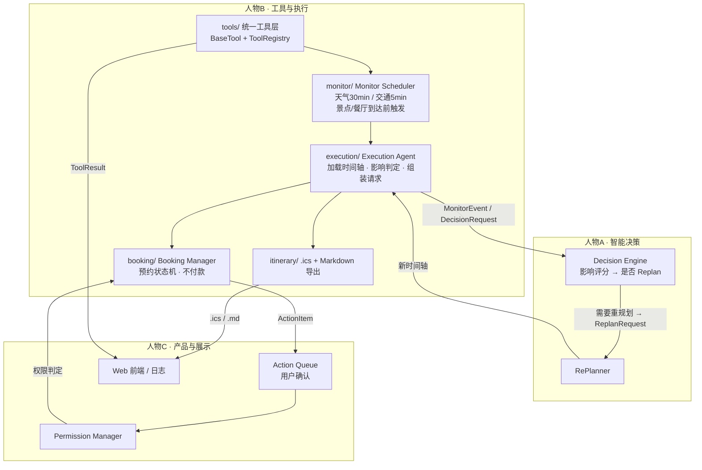

# 人物B工作报告 —— 工具与执行（系统负责人）

> 项目：TravelAgent 自主旅行管家
> 报告人：人物B（系统负责人）
> 日期：2026-07-31
> 职责范围：Tool Agents、API 封装、Monitor Scheduler、Execution Agent、Booking、Calendar

---

## 一、职责范围（源自《任务整理.md》分工表）

| 模块 | 说明 |
| --- | --- |
| Tool Agents | 地图 / 天气 / 景点 / 交通 / 餐饮 / 预约 六个领域 Agent，各自只封装自己的 API |
| API 封装 | 统一 `BaseTool` 抽象基类 + 统一返回契约 `ToolResult`，Mock 优先，可平滑切换真实 API |
| Monitor Scheduler | 定时轮询调度：天气 30min、交通 5min、景点到达前 20min、餐厅到达前 30min |
| Execution Agent | **项目核心**：加载行程时间轴，按时间驱动监控，评估事件影响，向 Decision Engine 提交决策请求 |
| Booking | 预约状态机（prepare→confirm→mark_confirmed 完整闭环 + scenic 自动填充，**不付款**），对接 Action Queue 契约 |
| Calendar | 生成 `.ics` 日历 + Markdown 行程单 |

---

## 二、接下来要做的主要工作

### 本阶段已完成（代码骨架 + 测试 + Demo + 真实 API 接入）

1. `core/schemas.py` — 全项目共享 JSON 接口契约（与 A/C 对齐的锚点）
2. `tools/` — 统一工具抽象层 + 9 个 Tool（Mock/Live 双版本，自动切换）
3. `monitor/monitor_scheduler.py` — asyncio 定时监控调度器
4. `execution/execution_agent.py` — 持续监控执行体（影响阈值判定 + DecisionRequest 组装）
5. `booking/booking_manager.py` — 预约状态机（prepare→confirm→mark_confirmed 完整闭环 + scenic 自动填充）+ ActionQueue 契约 + 付款人工提醒
6. `itinerary/` — `.ics` 日历 + Markdown 行程单导出
7. `tests/` — 工具 / 预约 / 调度 / 执行 / 导出 单元测试（125 个测试全部通过）
8. `demo/demo_scenario.py` — 比赛 Demo 剧情闭环脚本（混合模式：真实 API + 模拟突发事件）
9. `tools/qweather_client.py` — QWeatherClient 共享客户端（API KEY 认证 + Location ID/坐标缓存）
10. `tools/amap_client.py` — AmapClient 共享客户端（地理编码缓存 + 路线规划）
11. 天气 Live 版 4 个（实况/预警/空气质量/预报）+ 地图 Live + 交通 Live + 景点 Live + 餐饮 Live 已全部接入真实 API
12. `tool_introduction.md` — 完整工具层接口文档（含 API 端点映射、字段对照、v3→v5 升级说明）

### 待办（按优先级，供后续迭代）

- [ ] **M1 与 A 联调**：确认 `DecisionRequest` 契约字段；A 的 Decision Engine 消费后返回 `ReplanRequest`
- [ ] **M2 与 C 联调**：确认 `ActionItem` 契约；C 的 Action Queue / Permission Manager 消费 B 产出的动作
- [x] **M3 替换真实 API**：✅ 已完成 — 高德（地图+交通+景点+餐饮，POI 搜索已升级至 v5 API）、和风（天气 4 个端点含 v1 迁移）已接入，环境变量注入 Key
- [x] **M4 Demo 闭环**：✅ 已完成 — Demo 升级为混合模式（真实 API + 模拟突发事件），展示真实天气/景点/餐饮数据 + 3 个突发事件（暴雨/排队/交通拥堵）决策闭环
- [ ] **M5 生产化**：调度器容错重试、超时、日志落盘、配置热更新

---

## 三、里程碑

| 里程碑 | 内容 | 状态 |
| --- | --- | --- |
| M1 | 工具层 + Mock 跑通 | ✅ 完成 |
| M2 | Scheduler + Execution 跑通 Demo 剧情 | ✅ 完成 |
| M3 | Booking / Calendar + 契约联调 | ✅ 完成（骨架） |
| M3.5 | 真实 API 接入（天气 4 个 + 地图 + 交通 + 景点 + 餐饮 Live） | ✅ 完成 |
| M4 | Demo 混合模式闭环（真实 API + 模拟突发事件） | ✅ 完成 |

---

## 四、代码架构



关键点：**B 侧只依赖契约（`core/schemas.py`），不依赖 A 的实现** —— 通过 `decision_hook` 注入 Decision Engine、`on_event` 注入 C 的日志推送，保证 A/B/C 可并行开发、接口对得上。

---

## 五、接口契约草案（B 侧锚点）

见 `core/schemas.py`，核心数据结构：

| 契约 | 方向 | 说明 |
| --- | --- | --- |
| `ToolResult` | Tool → 上层 | 所有工具的统一返回（状态 / 数据 / 来源 / 耗时） |
| `PlannerOutput` | A → B | Planner 解析结果（B 的 Route Planner 消费） |
| `TripTimeline` | Route Planner → B | 行程时间轴（Execution Agent 驱动源） |
| `MonitorEvent` | B → A | 一次观测事件（天气 / 交通 / 景点 / 餐饮） |
| `DecisionRequest` | B → A | 达到影响阈值时提交的决策请求 |
| `ReplanRequest` | A → B/C | 重规划结果（新时间轴 + Explainable 原因） |
| `ActionItem` | B → C | Action Queue 的一项（状态 + 权限等级） |
| `BookingRequest` | Booking → 外部 | 预约请求（只准备，不付款） |

---

## 六、技术选型决策

- **纯 Python + asyncio 自研轻量框架**（核心零第三方依赖）
  - 优点：完全可控、无框架依赖风险、比赛可清晰展示架构深度；调度 / 执行层需要精细控制
  - 备选对比：LangGraph（RePlanner 图式编排强，但依赖重、易被质疑"套框架"）；AutoGen / CrewAI（多 Agent 开箱即用，但对强自定义流程受限）
  - 关键：契约层与框架无关，未来若换框架无需重写 tools
- **契约用 `dataclass`**（标准库），未来可平滑迁移 pydantic（字段名不变）
- **Mock 优先**：真实 API 通过环境变量注入 Key，切换时调用方零改动

---

## 七、运行方式

```bash
# 单元测试
python -m unittest discover -s tests -v

# Demo 剧情脚本
python -m demo.demo_scenario

# 可选：FastAPI 服务层（供 C 的 Web 前端）
pip install -r requirements.txt
uvicorn app.service:app --reload --port 8000
```

---

## 八、给团队的建议

1. **契约先行**：A/C 请先审阅 `core/schemas.py` 中的字段，联调前定稿
2. **Explainable 是比赛亮点**：建议 A 在 `ReplanRequest.reason` / `diff_summary` 中落实"为什么改"（对应《任务整理.md》第六节）
3. **Demo 剧情建议**：用 `demo/demo_scenario.py` 的剧情（暴雨 + 排队暴涨）展示"先评估影响，再决定是否重规划"，而不是直接改
4. **付款必须人工**：B 的 Booking 已强制 `Permission.MANUAL`，请 C 在 UI 上强调该交互
